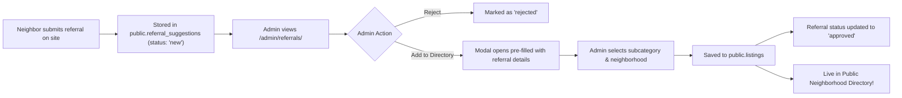

# Admin Referrals & Neighborhood Directory Control Implementation Plan

> **For agentic workers:** REQUIRED SUB-SKILL: Use superpowers:subagent-driven-development (recommended) or superpowers:executing-plans to implement this plan task-by-task. Steps use checkbox (`- [ ]`) syntax for tracking.

**Goal:** Provide full administrative control over neighborhood directory listings and enable a 1-click "Approve & Add to Directory" workflow for referral suggestions.

**Architecture:** Connect `public.referral_suggestions` moderation directly with `public.listings` creation. In `/admin/referrals/`, add an "Add to Directory" action that pre-fills a conversion modal, inserts into `public.listings`, and updates referral status to `approved`. In `/admin/directory/`, enhance the Directory CMS with full Edit, Delete, and Filter capabilities across all neighborhoods.

**Tech Stack:** Astro, Vanilla JavaScript, Supabase Postgres (RLS), CSS Design Tokens.

---

## Workflow Overview: How Referrals & Directories Connect

---

## File Changes Summary

- **Modify**: [`src/pages/admin/referrals.astro`](file:///c:/Users/marco/Documents/projects/onion-creek-repository/src/pages/admin/referrals.astro) — Add "Add to Directory" conversion modal markup and table action buttons.
- **Modify**: [`src/scripts/admin-referrals.js`](file:///c:/Users/marco/Documents/projects/onion-creek-repository/src/scripts/admin-referrals.js) — Wire category/subcategory loaders, conversion modal submit handler, and referral approval logic.
- **Modify**: [`src/pages/admin/directory.astro`](file:///c:/Users/marco/Documents/projects/onion-creek-repository/src/pages/admin/directory.astro) — Add "Edit Business Listing" modal markup, neighborhood filter controls, and UI/UX Pro Max table layout.
- **Modify**: [`src/scripts/admin-directory.js`](file:///c:/Users/marco/Documents/projects/onion-creek-repository/src/scripts/admin-directory.js) — Add listing editing, deletion, subcategory selection, and neighborhood filter sync.

---

## Detailed Tasks

### Task 1: Referral to Listing Conversion Modal in `/admin/referrals/`
**Files:**
- Modify: `src/pages/admin/referrals.astro`
- Modify: `src/scripts/admin-referrals.js`

- [ ] Add `#convertReferralModal` dialog in `referrals.astro` with inputs for:
  - Target Neighborhood (select)
  - Subcategory (grouped dropdown)
  - Business Name (input)
  - Phone (input)
  - Email (input)
  - Website (input)
  - Note / Recommendation (textarea)
  - Featured Provider (checkbox)
- [ ] Add `✨ Add to Directory` action button on each referral row in `referralsTableBody`.
- [ ] Wire modal opening and load subcategories from Supabase `subcategories` & `groups`.
- [ ] On submit:
  - Insert row into `public.listings` (`neighborhood_slug`, `subcategory_id`, `name`, `phone`, `email`, `website`, `note`, `featured`).
  - Update `public.referral_suggestions` status to `'approved'`.
  - Show success toast notification and refresh referrals table & KPIs.

---

### Task 2: Directory CMS Full CRUD Controls in `/admin/directory/`
**Files:**
- Modify: `src/pages/admin/directory.astro`
- Modify: `src/scripts/admin-directory.js`

- [ ] Add `#editListingModal` dialog in `directory.astro` for editing existing listings.
- [ ] Add `✏️ Edit` and `🗑️ Delete` buttons to each directory listing row in `listingsBody`.
- [ ] Wire Edit action:
  - Populate `#editListingModal` with listing properties (`id`, `name`, `phone`, `email`, `website`, `note`, `featured`, `subcategory_id`, `neighborhood_slug`).
  - On submit, execute `supabase.from('listings').update(...)` and refresh listing table.
- [ ] Wire Delete action:
  - Prompt confirmation with `confirmDialog`.
  - Execute `supabase.from('listings').delete().eq('id', id)` and show feedback toast.
- [ ] Add KPI summary cards to Directory CMS:
  - Total Listings across all neighborhoods.
  - Featured Providers count.
  - Active Categories count.
  - Active Neighborhoods count.

---

### Task 3: Build & Verification
- [ ] Execute `npm run build` to verify clean build.
- [ ] Test converting a referral into a directory listing.
- [ ] Test editing and deleting listings in Directory CMS.
